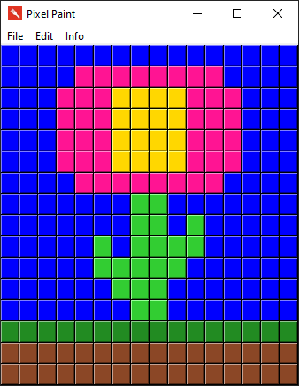

# Pixel-Paint
This is a program written in Tkinter which allows you to create art using Tkinter buttons.

# Pixel-Paint
This is a program written in Tkinter which allows you to create art using Tkinter buttons.

### About
-------------
This was my first program made with Tkinter. I don't remember when it was first created, but is very simple. You can create a canvas of different sizes and draw art by clicking on buttons.  
Unfortunately, no export to .png or .jpg is available.  
A modern and improved version of the program exists here: https://github.com/SP4R0W/ButtonPaint

### Getting Started
-------------
To compile this project, you will need at least Python 3.7.4.  
Do not forget you will need Tkinter library (I think it's installed by default with python, but use pip to install it if you don't have it).  
You're free to modify the project as you wish.

### Preview
-------------

